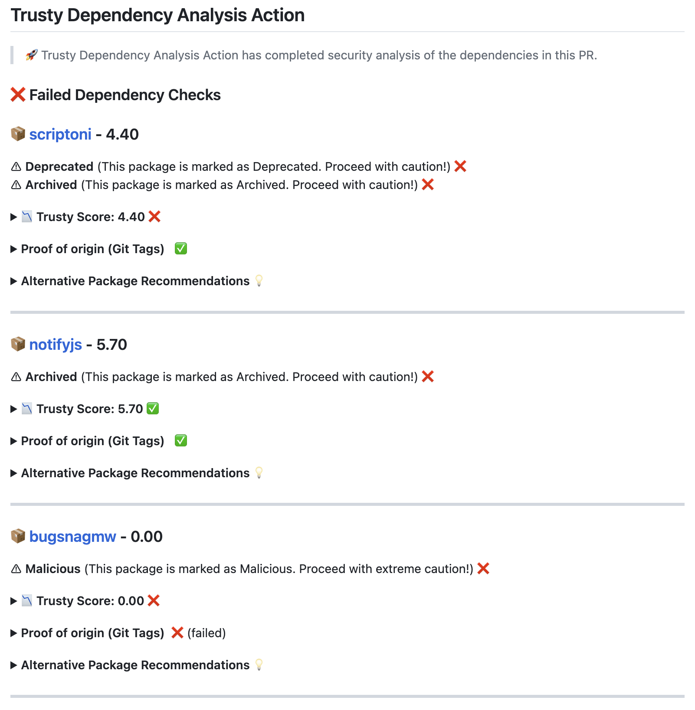
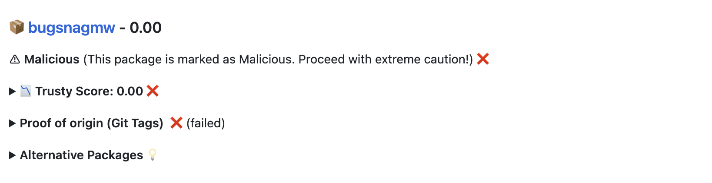
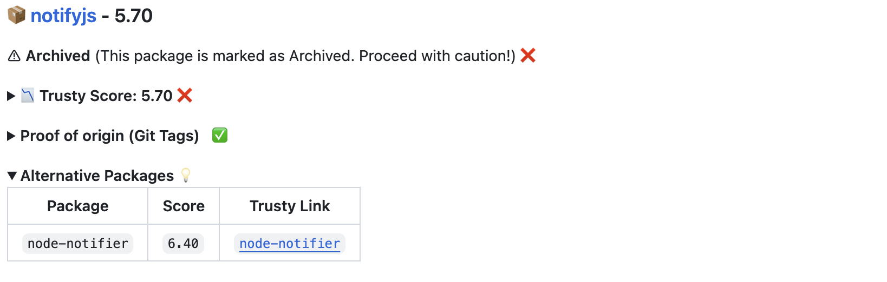
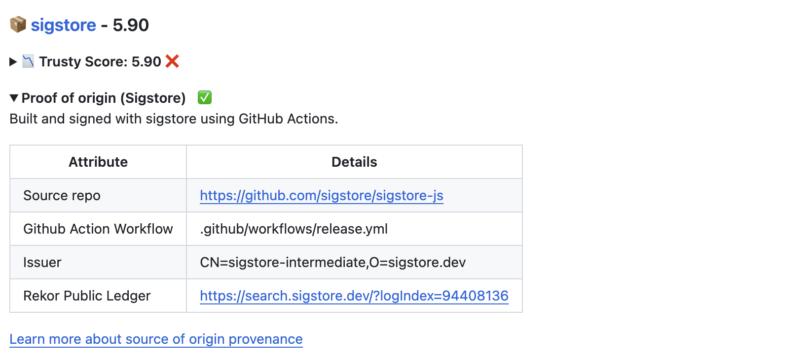
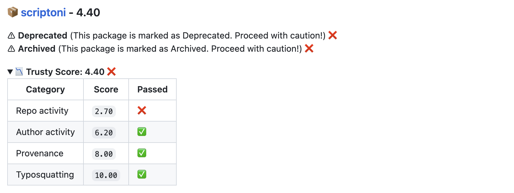

# Trusty Dependency Risk Action

### Check the quality and safety of dependencies in pull requests

[Trusty](https://trustypkg.dev/) by [Stacklok](https://stacklok.com) is a free-to-use service that helps developers assess dependency risk. Trusty uses statistical analysis of dimensions such as author and repo activity, along with a package’s source of origin, to provide an assessment about its trustworthiness.

This action integrates Trusty into your GitHub workflow,
allowing you to automatically check the quality and safety of your dependencies
on every pull request.

The Trusty service used by this action analyzes thousands of packages a day
across multiple languages to provide a security and quality
analysis of dependencies. Dependencies are run through a series of static analysis, machine learning, and malware
detection checks to capture potential security risks or quality issues.




## Overview

This action takes any added dependencies within a pull request and assesses their 
relative risk using the [Trusty](https://trustypkg.dev/) API. If any dependencies are
found to be below a certain threshold (see details below), the action will fail.

If any dependencies are malicious, deprecated, or archived, the action will also fail.

Language Support (inline with Trusty):

* Python
* JavaScript
* Java
* Rust
* Go

## Features

Check if dependencies are malicious, deprecated or archived



Check if dependencies are deprecated or archived (and get alternative recommendations)



Check if dependencies have a [proven source of origin provenance map](https://docs.stacklok.com/trusty/understand/provenance) (using sigstore or Git Tag / Release mapping)



Assess the author and repository activity and security risks of dependencies 



## Usage

To use this action, you can add the following to your workflow:

```yaml
name: TrustyPkg Dependency Check

on:
  pull_request:
    branches:
      - main

# Required for the action to post comments to pull requests
permissions:
  pull-requests: write

jobs:
  trusty_pkg_check:
    runs-on: ubuntu-latest
    name: Check Dependencies with TrustyPkg
    steps:
      - name: Checkout code
        uses: actions/checkout@v2

      - name: TrustyPkg Action
        uses: stacklok/trusty-action@v0.0.7
        with:
          global_threshold: 5
          provenance_threshold: 5
        env:
          GITHUB_TOKEN: ${{ secrets.GITHUB_TOKEN }}
```

> [!NOTE]  
> You do not need to create a GITHUB_TOKEN, the action uses the default token provided by GitHub Actions at runtime.

## Inputs

Only one input is available for this action:

`global_threshold`: The minimum score required for a dependency to be considered
high quality. Anything below this score will fail the action.


`repo_activity_threshold`: The minimum score required for a repo to be considered
actively maintained. Anything below this score will fail the action.

`author_activity_threshold`: The minimum score required for an author to be considered
actively maintaining their packages. Anything below this score will fail the action.

`provenance_threshold`: The minimum score required for a package to have a proven source
of origin. Anything below this score will fail the action.

`typosquatting_threshold`: The minimum score required for a package to be considered
not typosquatting. Anything below this score will fail the action.

`fail_on_malicious`: Whether to fail the action if a package is malicious. Default is `true`.

`fail_on_deprecated`: Whether to fail the action if a package is deprecated. Default is `true`.

`fail_on_archived`: Whether to fail the action if a package is archived. Default is `true`.

## Like this action?

If you like this action, please consider starring the repository and sharing it with your friends! You can also follow us on Twitter at [@trustypkg](https://twitter.com/trustypkg) for updates and news about TrustyPkg!

